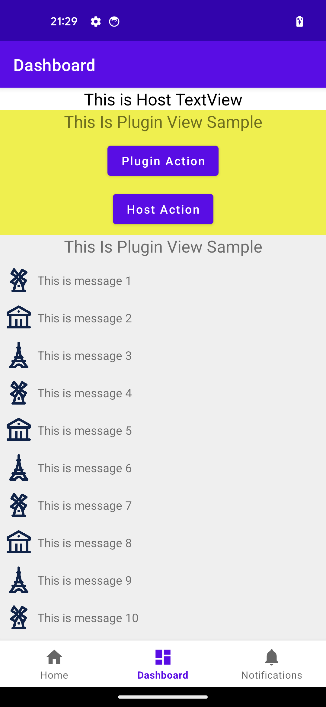

# 插件化框架 -- JoyPlug v1.0


## 特性
- 1.支持View级别的插件化
- 2.支持四大组件插件化，支持Fragment
- 3.支持纯业务逻辑（无界面）的插件设计
- 4.插件作为独立的Apk无感接入
- 5.简洁的宿主-插件路由API
<p></p>
  
## 理念
- 1.每个插件以包名为唯一标识。这在插件管理、插件路由等方面有所体现
- 2.插件自动寻找运行最新版本的apk
- 3.插件的加载可设置优先级，有高、中、低三个优先级可选


## 接入指南
### 【宿主】
#### 1. gradle
> Demo：host_sample
```
implementation("com.joybox.joyplug:host:1.0.+") // 宿主框架
implementation("com.joybox.joyplug:services:1.0.+") // 宿主服务
```

#### 2.添加Apk Provider
<p>Apk Provider作为插件Apk的提供者，供开发者自行提供Apk</p>
<p>待Apk准备完毕，构建ApkRecord并通过ApkProvideNotification通知框架</p>

```
PluginManager.addPluginApkProvider(applicationContext, object :
            IPluginApkProvider {
            override fun onGetAsync(notification: ApkProvideNotification) {
                // Activity Plugin Sample Apk
                provideApk("activity_plugin.apk") { apkPath ->
                    apkPath?.let {
                        val apkRecord = ApkRecord(
                            "com.joybox.joyplug.activity_plugin_sample",
                            1,
                            PluginPriority.HIGH,
                            it,
                            "",
                            System.currentTimeMillis()
                        )

                        notification.notifyApkReady(apkRecord)
                    }
                }
			}
}
```

### 3. init
```
PluginManager.init(applicationContext) {
    Log.i("PluginManager", "PluginManager init done")
}
```

### 4. 注册供插件使用的服务
如果插件需要使用宿主提供的能力，可以在module `services`中声明各种服务。并在宿主中注册：
```
PluginManager.registerService<NetService>(object : NetService {
	override fun GET(url: URL): String {
		Log.i("Service", "[NetService] GET() called.")
		return "success"
	}

	override fun POST(url: URL, params: JSONArray): String {
		Log.i("Service", "[NetService] POST() called.")
		return "success"
	}
})
```

在插件中使用：
```
val netService = HostServiceCenter.getService<NetService>()
val ret = netService?.GET(URL("https://www.test.com"))
```

### 5.跳转插件Activity：
```
PluginRouter.startActivity(
                requireActivity(),
                "com.joybox.joyplug.activity_plugin_sample",
                "com.joybox.joyplug.activity_plugin_sample.MainActivity",
                extras
            )
```
### 6. 引用插件View

```
<com.joybox.joyplug.host.core.component.PluginComponentView
        android:id="@+id/plugin_view"
        app:packageName="com.joybox.joyplug.view_plugin_sample"
        app:view="com.joybox.joyplug.view_plugin_sample.SampleView"
        android:layout_width="match_parent"
        android:layout_height="150dp"
        app:layout_constraintStart_toStartOf="parent"
        app:layout_constraintEnd_toEndOf="parent"
        app:layout_constraintTop_toBottomOf="@id/text_dashboard"
        />
```

### 【插件】
#### 独立App
> Demo：activity_plugin_sample

<p>在gradle中引入插件：</p>

```
id("com.joybox.joyplug.replacement")
```
<p>打包即可。</p>
<p>在debug模式下，该插件将不会运行，以支持插件app独立运行调试。</p>
<p>在release模式下，插件将执行Replace动作。原始Activity等类将替换成定制的插件Activity</p>

##### 在插件中跳转Activity
```
val intent = PluginIntent("com.joybox.joyplug.activity_plugin_sample.MainActivity")
context.startActivity(intent)

```

#### View插件

> Demo：view_plugin_sample, view_plugin_sample2
<p>在gradle中引入：</p>

```
implementation("com.joybox.joyplug:plugcore:1.0.+")
```
打包即可

#### 插件引用宿主服务
如果插件需要引用宿主能力（每个能力被打包为Service），可以引用如下模块
```
implementation("com.joybox.joyplug:services:1.0.+")
```
